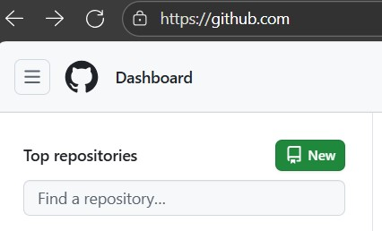
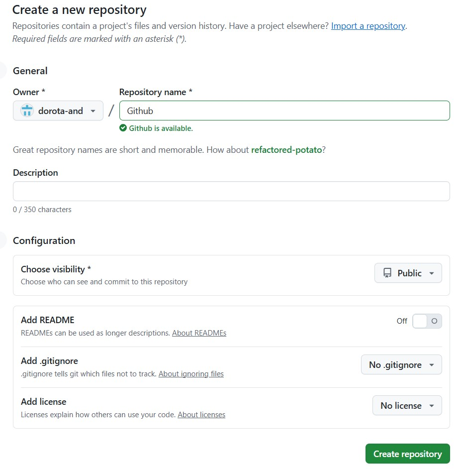
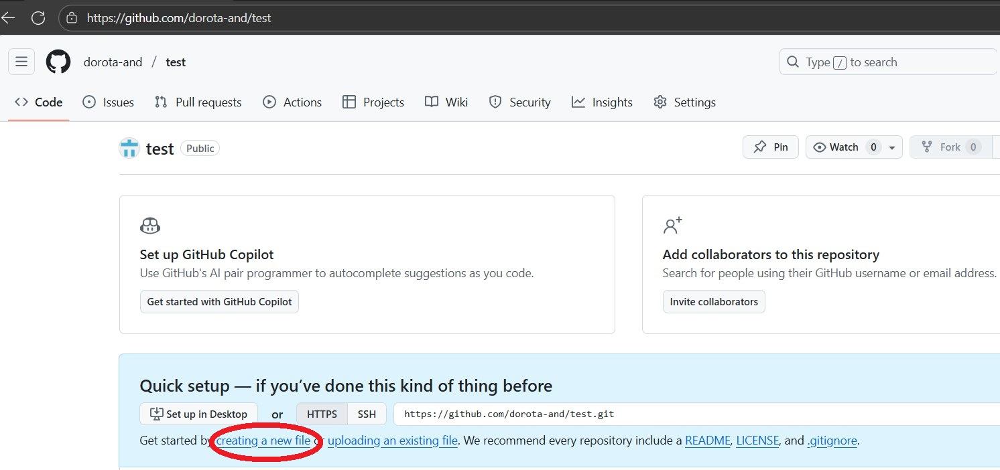
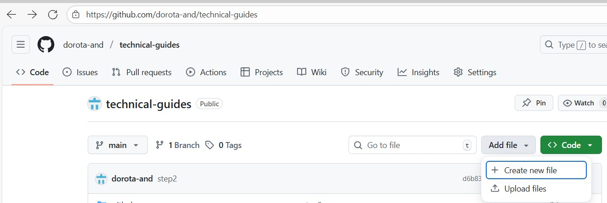
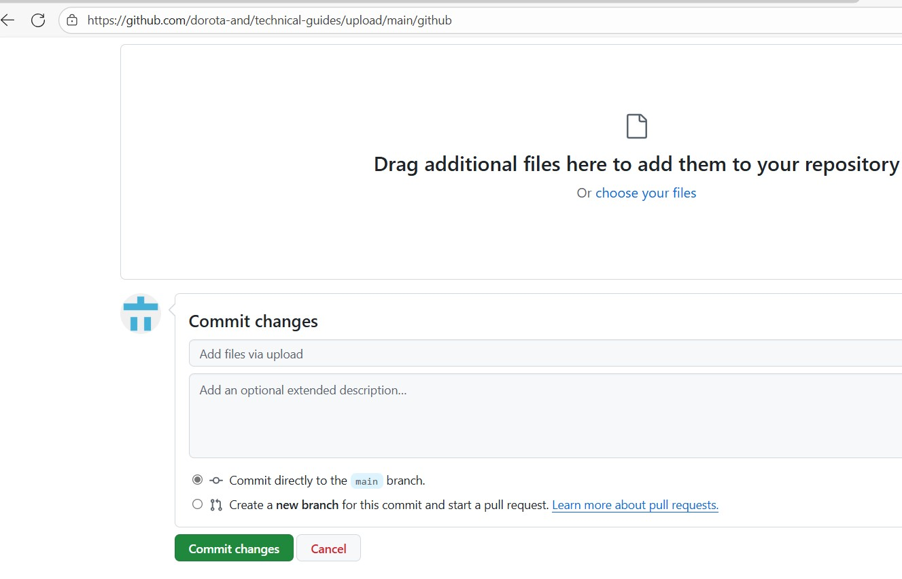

# Getting Started with Git and GitHub for Beginners

## Introduction

This beginner-friendly guide will help you install Git, set up your profile, create repositories, and push code to GitHub.

You’ll learn two simple ways to get started: using GitHub directly in your browser or working locally with Git.

## Table of Contents

- [Requirements](#requirements)
- [Using GitHub Only (Web Interface)](#using-github-only-web-interface)
  - [Create an Account](#create-an-account)
  - [Create a Repository](#create-a-repository)
  - [Add and Edit Files](#add-and-edit-files)
- [Resources](#resources)

## Requirements
- Web browser
- Internet connection
- GitHub account (sign up at [https://github.com](https://github.com))  

## Using GitHub Only (Web Interface)

### Create an Account

Go to [github.com](https://github.com) and sign up for a free account or click on <kbd>**Continue with Google**</kbd> to sign up using Google login.

 Follow the prompts to create your personal account.

During sign up, you'll be asked to verify your email address.

 Without a verified email address, you won't be able to use all GitHub features.

<kbd></kbd> 

### Create a Repository

1. Click <kbd>**New**</kbd> on **Dashboard**

<kbd></kbd>

2. Enter a **Repository name**, e.g. `my-first-repo`.

3. Choose visibility 
   - **Public** - anyone can see it,
   - **Private** - only for you. 

4. Click <kbd>**Create repository**</kbd>.

<kbd></kbd>

### Add and Edit Files

1. Use **creating a new file** or **uploading existing file** link to create or upload new files directly on GitHub.  

<kbd></kbd>

2. You can edit files and commit changes right in your browser.

Click the button <kbd>**Add file**</kbd> and choose one of the following:

<kbd></kbd>
  - **Create new files** - to write new file in your browser
  - **Upload files** - to add documents, images, code file or any  files. 
 
 3. After uploading or editing a file, scroll to the **Commit changes** section.  
You can write a short description or click the commit button directly.

 <kbd></kbd>

### Resources

- [GitHub Docs](https://docs.github.com/)
- [Git Handbook (by GitHub)](https://guides.github.com/introduction/git-handbook/)
- [GitHub Learning Lab](https://lab.github.com/)
- [Learn Git Branching (interactive)](https://learngitbranching.js.org/)

---
*This guide is part of my personal portfolio to help beginners get started with GitHub. Feel free to share or fork it!*

