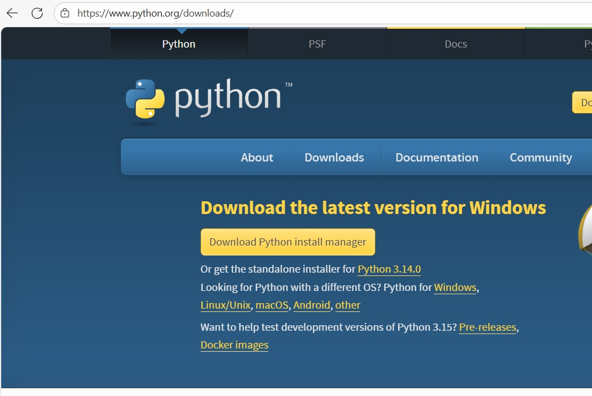
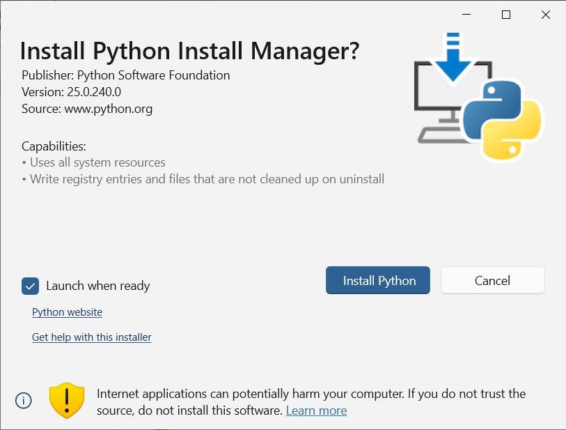
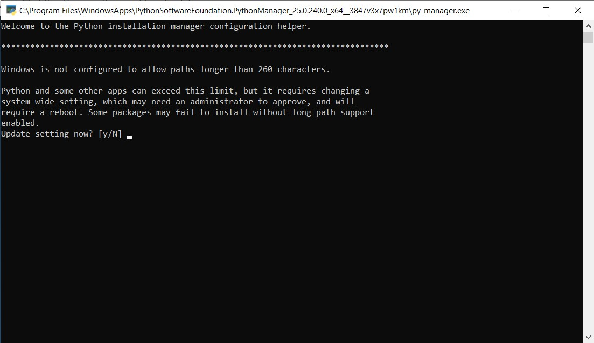
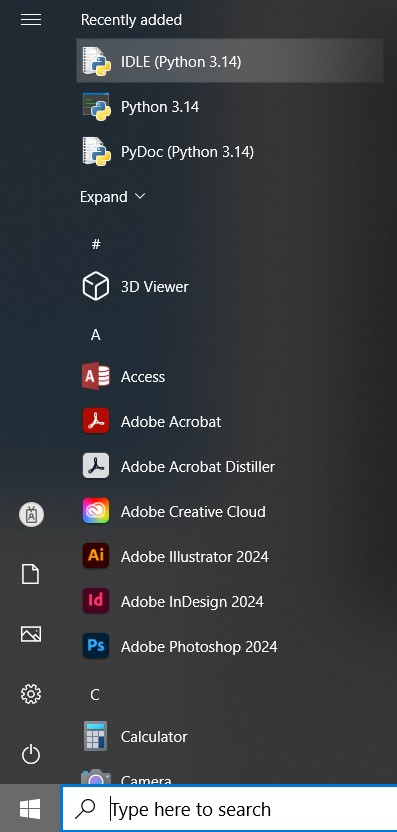
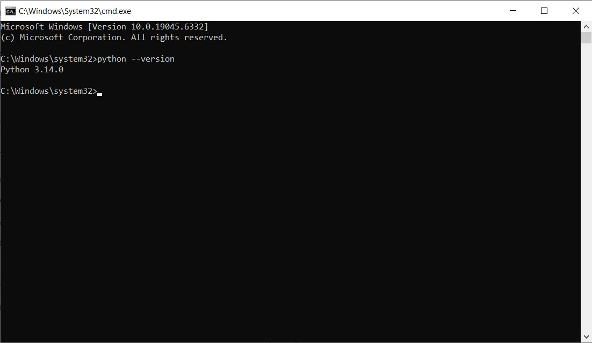

# Install Python on a Windows System

[Introduction](#introduction)

[Requirements](#requirements)

[Installation Steps](#installation-steps)

## Introduction 
Python is one of the most popular programming languages, used accros various fields – from data analysis and web development to artificial intelligence.

In this guide, you will learn step by step how to install Python on a Windows system.

## Requirements

Operating system: Windows 10 or newer

Internet connection to download the installer

## Installation Steps

1. Download the installer: Go to the official [Python website](https://www.python.org/downloads/) and download the latest version of the installer for Windows.

<kbd></kbd>

2. Run the installer: Click the downloaded file to launch the installer.

<kbd></kbd>

3. Start the installation: Click "Install Python" and wait for the process to complete.

<kbd></kbd>

4. Review the text during the installation process and answer the question, or press Enter to choose the default answer.

<kbd></kbd>

5. Go to the Start menu and open the installed application.

<kbd></kbd>

7. Run `phyton --version` command in windows shell

   
<kbd></kbd>
