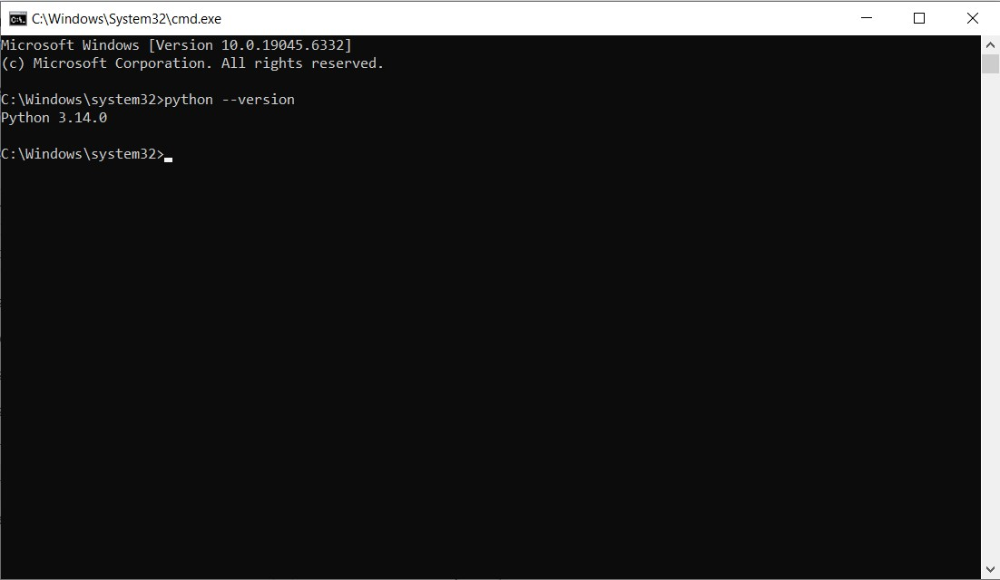

# Install Python on a Windows System

- [Introduction](#introduction)

- [Requirements](#requirements)

- [Installation Steps](#installation-steps)

- [Links](#links)


## Introduction 
Python is one of the most popular programming languages, used across various fields – from data analysis and web development to artificial intelligence.

This guide is written for beginners and includes step-by-step instructions for downloading and setting up Python on a Windows system.

## Requirements

- Operating system: Windows 10 or newer
- Internet connection to download the installer

## Installation Steps

#### Step 1: Download the Installer:

Go to the official Python website: [Python website](https://www.python.org/downloads/) and download the latest version of the Installer for Windows.

<kbd></kbd>

#### Step 2: Run the Installer: 

Click the downloaded file to launch the Installer.

<kbd></kbd>

#### Step 3: Start the Installer


Click **"Install Python"** and wait for the process to complete.  

<kbd></kbd>

#### Step 4: Follow the Prompts  

Review the messages during the installation process.

Answer any questions, or press **Enter** to accept default options.

<kbd></kbd>

#### Step 5: Launch Python 
Go to the **Start menu** and open the installed application (such as **IDLE** or **Python**).

<kbd></kbd>

#### Step 6: Verify the Installation  

Open **Command Prompt** and run 

```
python --version
``` 

<kbd></kbd>

## Links
[Python Beginners Guide](https://wiki.python.org/moin/BeginnersGuide)

